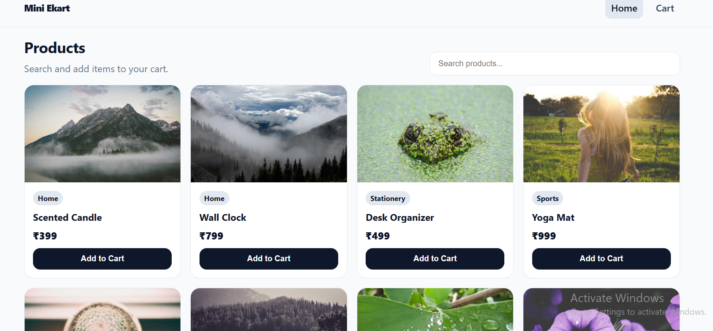
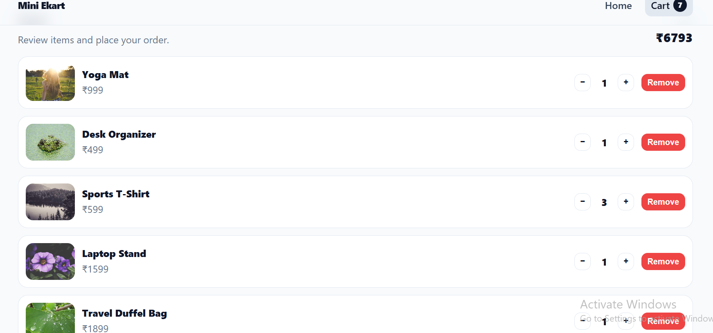
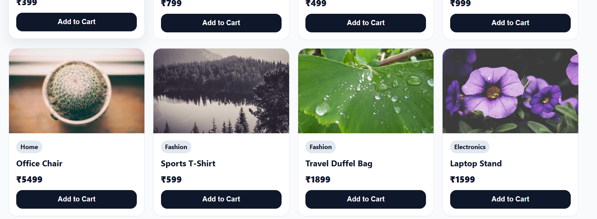

# Mini Ekart (MERN Mini E-Commerce)

## Overview
Mini Ekart is a mini interactive e-commerce module built with the MERN stack. It supports:
- Product listing + search + pagination
- Add to cart
- Update cart quantity (+ / −)
- Remove from cart
- Cart total + “Place Order” alert

## Tech Stack
- **Backend**: Node.js, Express, MongoDB (Mongoose)
- **Frontend**: React (Vite), React Router, Axios

## Prerequisites
- Node.js installed
- MongoDB running locally (or MongoDB Atlas)

## Setup (Backend)
Open a terminal:

```bash
cd backend
npm install
```

Create `backend/.env` (copy from `.env.example`) and set:
- `PORT=5000`
- `MONGO_URI=mongodb://127.0.0.1:27017/mini_ecommerce`
- `CLIENT_ORIGIN=http://localhost:5173`

Seed sample products:

```bash
npm run seed
```

Start backend:

```bash
npm run dev
```

Backend runs at `http://localhost:5000`.

## Setup (Frontend)
Open a second terminal:

```bash
cd frontend
npm install
```

Create `frontend/.env` (copy from `.env.example`) and set:
- `VITE_API_URL=http://localhost:5000`

Start frontend:

```bash
npm run dev
```

Frontend runs at `http://localhost:5173`.

## API Endpoints

### Products
- **POST** `/api/products` — create product
- **GET** `/api/products` — list products (supports `?search=&page=&limit=`)
- **GET** `/api/products/:id` — get single product

### Cart
- **GET** `/api/cart` — list cart items (populated) + `cartTotal`
- **POST** `/api/cart` — add to cart (upsert/increase)
- **PATCH** `/api/cart/:id` — update quantity (`{ action: "inc" | "dec" }`)
- **DELETE** `/api/cart/:id` — remove item

## Screenshots

### Home page



### Cart page



### Pagination example




## Postman Collection Export
In Postman:
1. Create a Collection and add requests for the endpoints above.
2. Click the collection **…** menu → **Export**.
3. Choose **Collection v2.1** and save the JSON file.

